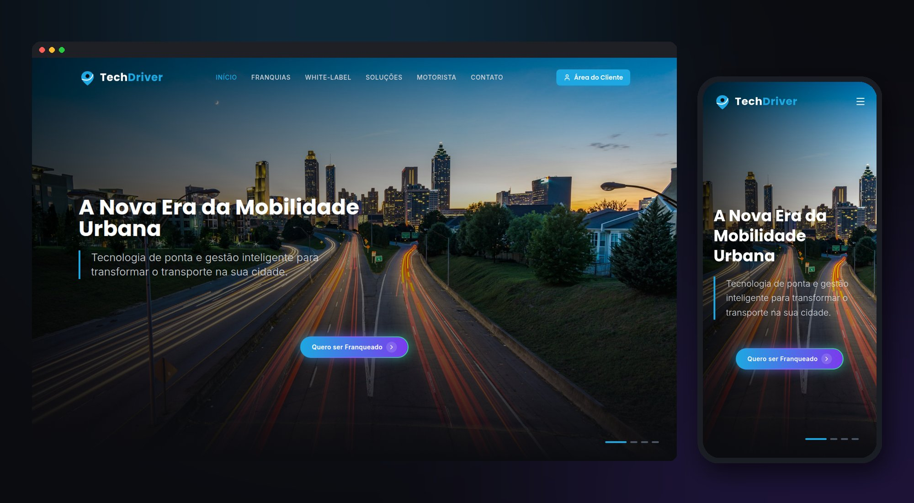

# TechDriver — Site Institucional



Site institucional da **TechDriver**, plataforma de mobilidade urbana com modelo de franquia e opção white label.

## Tecnologias

- React 19 + TypeScript
- Vite 6
- Tailwind CSS
- Framer Motion
- React Router
- Lucide Icons

## Estrutura

```
├── components/     # Componentes reutilizáveis
├── pages/          # Páginas (Home, Motorista, Contato...)
├── public/assets/  # Imagens e arquivos estáticos
├── App.tsx         # Rotas da aplicação
├── index.tsx       # Ponto de entrada
└── types.ts        # Tipagens compartilhadas
```

## Rodando localmente

**Pré-requisito:** Node.js 18+

```bash
npm install
npm run dev
```

O site abre em http://localhost:5174

## Build de produção

```bash
npm run build
npm run preview
```

---

© Fabio Technology Group — TechDriver
